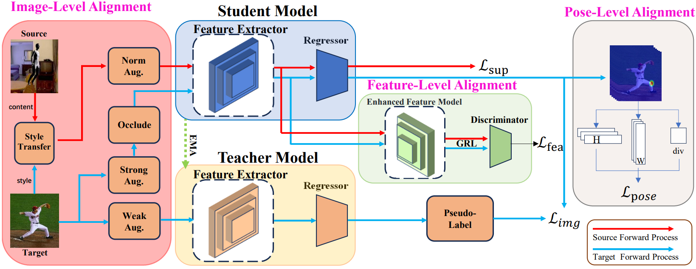

# [Domain Adaptive Pose Estimation Via Multi-level Alignment, ICME 2024](https://arxiv.org/pdf/2204.00172.pdf)
Code for [Domain Adaptive Pose Estimation Via Multi-level Alignment, ICME 2024](https://arxiv.org/pdf/2204.00172.pdf) 



As instructed by [RegDA](https://github.com/thuml/Transfer-Learning-Library/tree/master/examples/domain_adaptation/keypoint_detection), following datasets can be downloaded automatically:


- [Surreal Dataset](https://www.di.ens.fr/willow/research/surreal/data/)
- [LSP Dataset](http://sam.johnson.io/research/lsp.html)

**Aniaml Dataset**

Following [UDA-Animal-Pose](https://github.com/chaneyddtt/UDA-Animal-Pose) and [CCSSL](https://github.com/JitengMu/Learning-from-Synthetic-Animals)

**Pretrained Models**

Before training, please make sure style transfer models are downloaded and saved in the "saved_models" folder under this directory. Pretrained style transfer models in all experiments are available [here](https://drive.google.com/drive/folders/1WVjQ2Hq1CrtUr3AOlq1PxDuY50KpZ8lh?usp=sharing). 

# Experiments

- SURREAL-to-LSP
```
python train_human.py path/to/SURREAL path/to/LSP -s SURREAL -t LSP --target-train LSP_mt --log logs/s2l_exp/syn2real --debug --seed 0 --lambda_t 0  --pretrain-epoch 40 --rotation_stu 60 --shear_stu -30 30 --translate_stu 0.05 0.05 --scale_stu 0.6 1.3 --color_stu 0.25 --blur_stu 0 --rotation_tea 60 --shear_tea -30 30 --translate_tea 0.05 0.05 --scale_tea 0.6 1.3 --color_tea 0.25 --blur_tea 0 -b 32 --mask-ratio 0.5 --k 1 --decoder-name saved_models/decoder_s2l_0_1.pth.tar --s2t-freq 0.5 --s2t-alpha 0 1 --t2s-freq 0.5 --t2s-alpha 0 1 --occlude-rate 0.5 --occlude-thresh 0.9 
```

SyntheticAnimal-to-TigDog
```
python train_animal.py --image-path animal_data  --source synthetic_animal_sp_all --target real_animal_all --target_ssl real_animal_all_mt --train_on_all_cat --log logs/syn2real_animal/syn2real --debug --seed 0  --pretrain-epoch 40 --rotation_stu 60 --shear_stu -30 30 --translate_stu 0.05 0.05 --scale_stu 0.6 1.3 --color_stu 0.25 --blur_stu 0 --rotation_tea 60 --shear_tea -30 30 --translate_tea 0.05 0.05 --scale_tea 0.6 1.3 --color_tea 0.25 --blur_tea 0 --k 1 -b 32  --mask-ratio 0.5 --decoder-name saved_models/decoder_animal_0_1.pth.tar --s2t-freq 0.5 --s2t-alpha 0 1 --t2s-freq 0.5 --t2s-alpha 0 1 --occlude-rate 0.5 --occlude-thresh 0.9
```

SyntheticAnimal-to-AnimalPose
```
python train_animal_other.py --image-path animal_data  --source synthetic_animal_sp_all_other --target animal_pose --target_ssl animal_pose_mt --train_on_all_cat --log logs/syn2animal_pose/syn2real --debug --seed 0  --pretrain-epoch 40 --rotation_stu 60 --shear_stu -30 30 --translate_stu 0.05 0.05 --scale_stu 0.6 1.3 --color_stu 0.25 --blur_stu 0 --rotation_tea 60 --shear_tea -30 30 --translate_tea 0.05 0.05 --scale_tea 0.6 1.3 --color_tea 0.25 --blur_tea 0 --k 1 -b 32  --mask-ratio 0.5 --decoder-name saved_models/decoder_animal_0_1.pth.tar --s2t-freq 0.5 --s2t-alpha 0 1 --t2s-freq 0.5 --t2s-alpha 0 1 --occlude-rate 0.5 --occlude-thresh 0.9
```
             
# Acknowledgment

Code borrowed from [RegDA](https://github.com/thuml/Transfer-Learning-Library/tree/master/examples/domain_adaptation/keypoint_detection), [UDA-Aniaml](https://github.com/chaneyddtt/UDA-Animal-Pose) ,[UDA-Pose](https://github.com/VisionLearningGroup/UDA_PoseEstimation)and [AdaIN](https://github.com/xunhuang1995/AdaIN-style).

